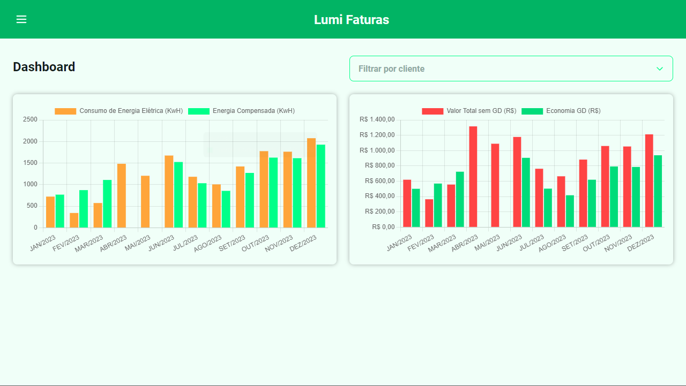
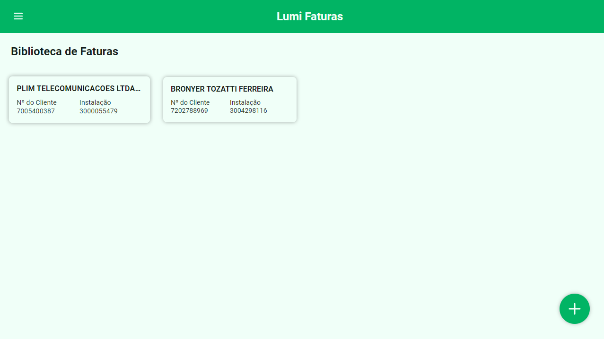

# Lumi Faturas - APP

Aplicação para extração e controle de dados vindos de faturas em PDF. Suas principais funcionalidades são:

1. Dashboard.
2. Biblioteca de Faturas.

### Screens

## Executando o projeto

- Após clonar o projeto:
- `yarn` para instalar as dependências;
- `yarn start` para rodar o projeto;

## API e UI/UX

- [Lumi Faturas - API](https://github.com/FernandoRidam/faturas-backend)
- [Figma](https://www.figma.com/design/S5pxsAbolB4KgKPuTVMDxK/Lumi-Faturas?node-id=0-1&t=4pfFaeu8cGTEjMY4-1)

## Tecnologias e Bibliotecas

### React

- O [React](https://react.dev/) foi utilizado em sua versão 18.3.1

### Principais libs:

- [Axios](https://github.com/axios/axios) Biblioteca para o consumo da apis externas.
- [React Router Dom](https://www.npmjs.com/package/react-router-dom) Biblioteca de gerenciamento da navegação entre telas.
- [Phosphor Icons](https://phosphoricons.com/) Família de ícones flexível para interfaces.
- [Chart.js, React Chartjs 2](https://www.chartjs.org/) Biblioteca que auxilia exibição dos gráficos.
- [Styled Components](https://styled-components.com/) Biblioteca que facilita na estilização dos componentes e telas.
- [Framer Motion](https://www.framer.com/motion/) Biblioteca que facilita na criação de animações.
- [Date FNS](https://date-fns.org/) Biblioteca que auxiliar na tratativa de datas.
- [Notistack](https://notistack.com/) Biblioteca de balões de notificação.

### Padrões

#### Componentização de código reutilizável

Componentes foram criados para evitar a repetição de código. Os componentes são reutilizáveis e não contem regras de negócio, podendo ser utilizados nas variadas telas.

#### Separação de responsabilidades

- Uma camada de serviço foi criada e atua de forma transparente para as camadas superiores, seu funcionamento nao depende das regras superiores e vice e versa.
- As telas se preocupam em obter inputs dos usuários e mostrar resultados. Dessa forma, adicionar uma nova tela não é um trabalho tão árduo.
